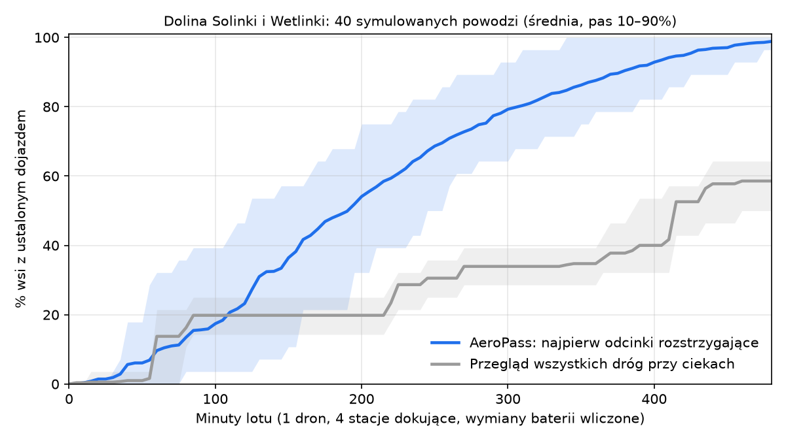

# AeroPass

**Autonomiczny zwiad dronowy przejezdności dróg i zalania ulic dla PSP i OSP.**
Po alarmie powodziowym drony same sprawdzają najpierw te odcinki dróg, od których zależy dojazd do wsi. Stanowisko kierowania dostaje odpowiedź: *którędy i jakim pojazdem dojedziemy do każdej miejscowości*, ze źródłem, wiekiem i pewnością informacji. Decyzję podejmuje człowiek.

*(Tu wstawić GIF z demo.)*

Projekt na Dual Use Hackathon 2026 (Carpathian Drone Summit, Jasionka). Scenariusz demo: **dolina Solinki i Wetlinki (Bieszczady)**.

## Wyniki

**Symulacja 40 powodzi na prawdziwej sieci dróg doliny** (OSM; 359 odcinków utwardzonych przy ciekach, 119 km). 4 drony, każdy ze swojej stacji dokującej:

| | AeroPass: najpierw odcinki rozstrzygające | Przegląd wszystkich dróg przy ciekach |
|---|---|---|
| mediana czasu do ustalenia dojazdu do **90% wsi** | **91 min** | 150 min |
| mediana czasu do **100% wsi** | **111 min** | 158 min |
| średnio wsi z ustalonym dojazdem **po 60 min** | **75%** | 68% |
| (1 dron) mediana do 90% wsi | 357 min | 608 min |



Szczegóły i założenia: [`wyniki/monte_carlo.json`](wyniki/monte_carlo.json), wykres dla 1 drona: [`wyniki/monte_carlo_1dron.png`](wyniki/monte_carlo_1dron.png).

**Rozmieszczenie stacji dokujących** (faza przygotowania): algorytm wybrał 4 miejscowości (Przysłup, Terka, Tyskowa, Wetlina), z których drony sięgają **118,8 z 119,2 km** dróg przy ciekach (22 min użytecznego lotu, 12 m/s).

**Model AI: zalana czy przejezdna** (YOLO11n-seg, 25 epok, FloodNet, oficjalny podział; ocena na **zbiorze testowym** 448 zdjęć, z czego 253 z widoczną jezdnią):

| Decyzja na zdjęciu | Wynik |
|---|---|
| **zalana droga uznana za przejezdną (fałszywie bezpieczna)** | **0 z 47** (górna granica 95% ≈ 6%) |
| zalanie wykryte | 41 z 47 (87%) |
| zalana → „nie wiadomo” (system nie zgaduje) | 6 z 47 (13%) |
| sucha droga uznana za zalaną (fałszywy alarm) | 0 z 206 |
| sucha → „nie wiadomo” | 20 z 206 (10%) |

- Źródło: [`wyniki/metryki_decyzji.json`](wyniki/metryki_decyzji.json).
- Jednostką jest zdjęcie jako przybliżenie odcinka drogi.
- Jakość samych masek zalanej drogi na poziomie pikseli jest słaba (mAP50-95 = 0,05, [`wyniki/metryki.json`](wyniki/metryki.json)), więc decyzję podejmujemy na poziomie zdjęcia, a nie obrysu wody.
- Metryka FloodNet jest dowodem technicznym, a nie deklaracją gotowości operacyjnej w Polsce (zdjęcia z Teksasu).

## Co jest prawdziwe, co symulowane, co jest koncepcją

| Element | Status |
|---|---|
| Sieć dróg, mosty, cieki i wsie doliny Solinki i Wetlinki | **prawdziwe** (OpenStreetMap, `dane/osm/`) |
| Progi alarmowe wodowskazu Kalnica (Wetlina), wiatr w Lesku | **prawdziwe** (API IMGW, `dane/imgw/`) |
| Planer (wybór odcinków), status wsi dla klas pojazdów, trasy, meldunki z szablonu | **prawdziwy kod** (`planer/`) |
| Rozmieszczenie stacji dokujących | **prawdziwy kod**; miejscowości jako przybliżenie lokalizacji remiz OSP |
| Model segmentacji zalanych dróg i jego metryka | **prawdziwy trening** na FloodNet (`ai/aeropass_trening.ipynb`) |
| Panel stanowiska kierowania, zatwierdzanie, dziennik decyzji, eksport GeoJSON/KML | **działa** (`panel/`) |
| Poziom wody ponad progiem, porywy wiatru | symulowane |
| Które odcinki są zalane lub zerwane (`scenariusz/`) | **symulowane** (prawdopodobieństwa w `planer/scenariusz.py`) |
| Przelot dronów, obrazy z drona | symulowane (obrazy zastępcze z FloodNet) |
| Stacje dokujące, loty BVLOS, integracja z systemami PSP | koncepcja |

W danych każdy obiekt ma pole `"symulowane"`, a panel pokazuje, co jest założeniem, a co obserwacją.

## Jak uruchomić

Wymaga Pythona 3.10+ (sprawdzone na 3.14).

```bash
python3 -m venv ~/.venvs/aeropass && source ~/.venvs/aeropass/bin/activate
pip install networkx matplotlib
python panel/serwer.py        # terminal 1 → http://localhost:8765/panel/
python demo.py --tempo 3      # terminal 2; w panelu kliknij „Zatwierdź start drona”
```

- `python demo.py --auto` zatwierdza start automatycznie.
- `python planer/monte_carlo.py 40` przelicza symulację i wykresy (ok. 1 min).
- Testy logiki (asercje): `python planer/siec.py`, `python planer/meldunek.py`, `python ai/yolo_to_decision.py`.

## Jak to działa

1. **Potrzeba:** stan wody na wodowskazie ≥ stan alarmowy → system weryfikuje zagrożenie i proponuje misję.
2. **Można latać:** wiatr i porywy według progów (zielone / żółte / czerwone), przestrzeń powietrzna. Start zatwierdza operator.
3. **Zwiad:** każdy dron w swoim sektorze wybiera odcinek, który leży na najkrótszej możliwej trasie największej liczby wsi o nieustalonym dojeździe, w stosunku do kosztu dolotu. Po każdej obserwacji planuje od nowa.
4. **Analiza:** model rozpoznaje zalaną lub niezalaną jezdnię; **brak dowodu = „nie wiadomo”, nigdy „przejezdna”**.
5. **Status wsi** dla wozu ciężkiego i terenowego:
   - „dostępna”: istnieje trasa wyłącznie po odcinkach sprawdzonych jako przejezdne,
   - „odcięta”: nie ma trasy nawet przy założeniu, że nieznane odcinki są przejezdne,
   - „nie wiadomo”: wszystko pomiędzy.

   Drogi leśne liczą się tylko dla pojazdu terenowego i tylko po sprawdzeniu.
6. **Meldunek z szablonu (bez LLM):** fakty, ocena, rekomendacja i termin decyzji, a każde zdanie ma źródło.
7. **Decyzja:** dyżurny zatwierdza, zmienia albo odrzuca; potem potwierdza wykonanie. Wszystko trafia do dziennika.

Format danych między modułami: [FORMAT.md](FORMAT.md).

## Dual-use

Ta sama warstwa rozpoznania przejezdności tras służy **WOT i wojsku** do planowania konwojów z pomocą i ewakuacji ludności (WOT wspierała ludność podczas powodzi 2024). Zastosowanie jest wyłącznie defensywne i organizacyjne. Eksport GeoJSON/KML pozwala przekazać wynik do innych systemów.

## Ograniczenia (znane)

- Obserwacja w symulacji jest bezbłędna; błąd modelu AI podajemy osobno, a w praktyce każdy meldunek ma zdjęcie do weryfikacji przez człowieka.
- Parametry lotu (22 min użytecznych, 12 m/s, 3 min wymiany baterii) to założenia dla platformy klasy DJI Matrice 30; trzeba je skalibrować testem.
- Loty BVLOS wymagają zezwolenia w kategorii szczególnej; propozycja: korytarze wzdłuż rzek zatwierdzone przed sezonem powodziowym.
- Model trenowany na zdjęciach z Teksasu; potrzebny test na zdjęciach z Polski.

## Użycie AI i zasobów zewnętrznych

Wymóg regulaminu (IX):

- **Narzędzia AI:** Claude (Anthropic) pomagał w analizie zadania, koncepcji, kodzie (planer, symulacja, demo, panel, notatnik treningu) i dokumentacji. Zespół sprawdzał i uruchamiał kod oraz podejmował decyzje projektowe.
- **Model:** Ultralytics YOLO11n-seg (AGPL-3.0), douczony na FloodNet.
- **Biblioteki:**
  - networkx (BSD-3-Clause), matplotlib (licencja PSF-podobna, matplotlib License),
  - Leaflet 1.9.4 (BSD-2-Clause, `panel/vendor/leaflet/LICENSE`),
  - numpy, Pillow, OpenCV, PyTorch (w notatniku treningu).
- **Dane:**
  - OpenStreetMap: © OpenStreetMap contributors, licencja ODbL 1.0,
  - IMGW-PIB, dane publiczne: © Instytut Meteorologii i Gospodarki Wodnej – Państwowy Instytut Badawczy,
  - FloodNet: CDLA-Permissive 1.0. Rahnemoonfar i in., „FloodNet: A High Resolution Aerial Imagery Dataset for Post Flood Scene Understanding”, IEEE Access 9, 2021, doi:10.1109/ACCESS.2021.3090981.

## Licencja

Kod: **AGPL-3.0** (patrz [LICENSE](LICENSE)), bo model korzysta z Ultralytics YOLO (AGPL-3.0). Dane zewnętrzne pozostają na swoich licencjach (wyżej).
