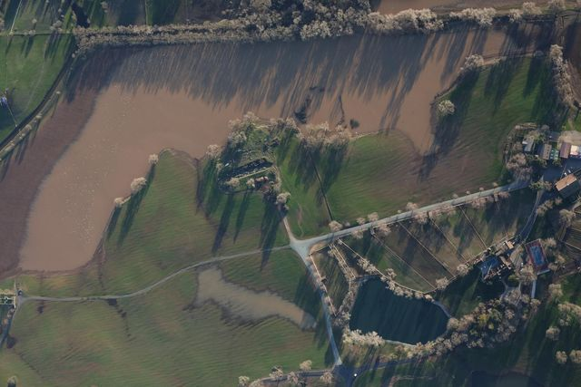

# AeroPass

**Autonomiczny zwiad dronowy przejezdności dróg i zalania ulic dla PSP i OSP.**
Po alarmie powodziowym drony same sprawdzają najpierw te odcinki dróg, od których zależy dojazd do wsi. Stanowisko kierowania dostaje odpowiedź: *którędy i jakim pojazdem dojedziemy do każdej miejscowości*, ze źródłem, wiekiem i oznaczeniem niepewności. Decyzję podejmuje człowiek.

Projekt na Dual Use Hackathon 2026 (Carpathian Drone Summit, Jasionka). Scenariusz demo: **dolina Solinki i Wetlinki (Bieszczady)**.

## Wyniki

**Symulacja 40 powodzi na prawdziwej sieci dróg doliny** (OSM; 359 odcinków utwardzonych przy ciekach, 119 km). Z 30 wsi 28 ma początkowo nieznany dojazd; poniższe odsetki dotyczą tych 28 wsi. 4 drony, każdy ze swojej stacji dokującej:

| | AeroPass: najpierw odcinki rozstrzygające | Przegląd wszystkich dróg przy ciekach |
|---|---|---|
| mediana czasu do ustalenia dojazdu do **90% początkowo nieznanych wsi** | **92 min** | 133 min |
| mediana czasu do **100% początkowo nieznanych wsi** | **112 min** | 148 min |
| średnio z ustalonym dojazdem **po 60 min** | **75%** | 56% |
| (1 dron) mediana do 90% początkowo nieznanych wsi | 351 min | 588 min |


Szczegóły i założenia: [`wyniki/monte_carlo.json`](wyniki/monte_carlo.json), wykres dla 1 drona: [`wyniki/monte_carlo_1dron.png`](wyniki/monte_carlo_1dron.png).

**Rozmieszczenie stacji dokujących** (faza przygotowania): algorytm wybrał 4 miejscowości (Przysłup, Terka, Tyskowa, Wetlina), z których drony sięgają **118,8 z 119,2 km** dróg przy ciekach (22 min użytecznego lotu, 12 m/s).

**Model AI: zalana czy przejezdna** (YOLO11n-seg, 25 epok, FloodNet, oficjalny podział; ocena na **zbiorze testowym** 448 zdjęć, z czego 253 z widoczną jezdnią):

| Decyzja na zdjęciu | Wynik |
|---|---|
| **zalana droga uznana za przejezdną (fałszywie bezpieczna)** | **0 z 47** (górna granica 95% ≈ 6%) |
| zalanie wykryte | 41 z 47 (87%) |
| zalana → „nie wiadomo” (system nie zgaduje) | 6 z 47 (13%) |
| sucha droga uznana za zalaną (fałszywy alarm) | 0 z 206 |
| sucha → „nie wiadomo” | 20 z 206 (10%) |

- Źródło: [`wyniki/metryki_decyzji.json`](wyniki/metryki_decyzji.json).
- Jednostką jest zdjęcie jako przybliżenie odcinka drogi.
- Jakość samych masek zalanej drogi na poziomie pikseli jest słaba (mAP50-95 = 0,05, [`wyniki/metryki.json`](wyniki/metryki.json)), więc decyzję podejmujemy na poziomie zdjęcia, a nie obrysu wody.
- Metryka FloodNet jest dowodem technicznym, a nie deklaracją gotowości operacyjnej w Polsce (zdjęcia z Teksasu).

**Dodatkowa biblioteka źródłowa:** 1500 zdjęć lotniczych z [LADI v2](https://huggingface.co/datasets/MITLL/LADI-v2-dataset), pomniejszonych do 640 px: [`dane/ladi/obrazy/`](dane/ladi/obrazy/), [manifest z etykietami i sumami SHA-256](dane/ladi/manifest.csv), [źródło i licencja CC BY 4.0](dane/ladi/README.md). 1143 obrazy mają etykietę obecności drogi, a 161 etykietę obecności zalania. Dodano je do przeglądania, **bez nowego treningu ani oceny modelu**. Etykiety mówią o obecności drogi i zalania na zdjęciu osobno, nie o przejezdności odcinka.



## Co jest prawdziwe, co symulowane, co jest koncepcją

| Element | Status |
|---|---|
| Sieć dróg, mosty, cieki i wsie doliny Solinki i Wetlinki | **prawdziwe** (OpenStreetMap, `dane/osm/`) |
| Progi alarmowe wodowskazu Kalnica (Wetlina), wiatr w Lesku | **prawdziwe** (API IMGW, `dane/imgw/`) |
| Planer (wybór odcinków), status wsi dla klas pojazdów, trasy, meldunki z szablonu | **prawdziwy kod** (`planer/`) |
| Rozmieszczenie stacji dokujących | **prawdziwy kod**; miejscowości jako przybliżenie lokalizacji remiz OSP |
| Model segmentacji zalanych dróg i jego metryka | **prawdziwy trening** na FloodNet (`ai/aeropass_trening.ipynb`) |
| 1500 zdjęć lotniczych LADI v2 | **prawdziwa biblioteka referencyjna**, bez treningu i bez wpływu na wyniki modelu (`dane/ladi/`) |
| Panel stanowiska kierowania, zatwierdzanie, dziennik decyzji, eksport GeoJSON/KML | **działa** (`panel/`) |
| Przyciski symulacji w panelu, analiza filmu z poligonami YOLO | **działa** (`panel/`, `ai/film.py`); film dostarcza użytkownik |
| Poziom wody ponad progiem, porywy wiatru | symulowane |
| Które odcinki są zalane lub zerwane (`scenariusz/`) | **symulowane** (prawdopodobieństwa w `planer/scenariusz.py`) |
| Przelot dronów, obrazy z drona | symulowane (obrazy zastępcze z FloodNet) |
| Stacje dokujące, loty BVLOS, integracja z systemami PSP | koncepcja |

W danych każdy obiekt ma pole `"symulowane"`, a panel pokazuje, co jest założeniem, a co obserwacją.

## Jak uruchomić

Wymaga Pythona 3.10+ (sprawdzone na 3.14) i ffmpeg (tylko do analizy filmu).

```bash
python3 -m venv ~/.venvs/aeropass && source ~/.venvs/aeropass/bin/activate
pip install networkx matplotlib ultralytics
python panel/serwer.py        # → http://localhost:8765/panel/
```

W panelu, na pasku **Symulacja**:

1. Opcjonalnie wybierz numer scenariusza albo kliknij **🎲 Nowa losowa powódź**. Scenariusz 56 to ten z prezentacji.
2. Opcjonalnie kliknij drogę przy cieku, żeby ją zalać; drugi klik zrywa most albo blokuje drogę, trzeci usuwa zmianę. Fioletowa linia to scenariusz, którego system nie zna, dopóki dron go nie sprawdzi. **Pokaż prawdę scenariusza** odsłania całą wylosowaną powódź.
3. Wybierz strategię: AeroPass (najpierw odcinki rozstrzygające) albo przegląd wszystkich dróg przy ciekach.
4. **▶ Start**, a potem **Zatwierdź start drona**, bo decyduje człowiek. **⏸ Pauza**, **Tempo** i **↺ Reset** działają w trakcie.

Kafelek „min do ustalenia 50% / 90% wsi” służy do porównania strategii na tym samym scenariuszu. AeroPass szybciej ustala dojazd do 90% wsi w każdej z 40 powodzi z wykresu i w 35 z kolejnych 40 losowań (scenariusze 1–40). Scenariusz 56 jest wyjątkiem: połowę wsi ustala w 30 zamiast 61 min, ale 90% o 10 min później. Do porównania na żywo lepsze są np. scenariusze 7 i 21.

- Bez panelu: `python demo.py --tempo 3 [--auto] [--ziarno 56] [--strategia A|B]`.
- `python planer/monte_carlo.py 40` przelicza symulację i wykresy (ok. 1 min).
- Testy logiki (asercje): `python planer/siec.py`, `python planer/meldunek.py`, `python test_demo_inputs.py`, `python test_monte_carlo_determinism.py`, `python test_kamera.py`, `python ai/film.py --test`.
- Integralność zdjęć LADI v2: `python ai/import_ladi.py --check`.

### Analiza filmu z drona (offline, po locie)

W panelu kliknij **Analiza filmu z drona ↗** (albo otwórz http://localhost:8765/panel/film.html). Wybierz film, wpisz jego źródło i licencję, potem **Wgraj i analizuj**. Z terminala: `python ai/film.py film.mp4 --zrodlo "autor, link, licencja"`.

- Każda klatka przechodzi przez model YOLO11n-seg (`wyniki/best.pt`). Na filmie pojawiają się poligony: zalana droga, sucha droga, zalany budynek.
- Pasek u góry filmu to ocena odcinka z ostatniej sekundy. Zalanie wygrywa już przy ¼ klatek, przejezdność wymaga większości, a brak dowodu to „nie wiadomo”.
- Wynik trafia do `film/wyniki/<nazwa>/`: film MP4 (H.264), 4 kadry PNG do slajdów, `podsumowanie.json` z szybkością przetwarzania.
- Katalog `film/` jest poza gitem; filmy z internetu mają własne licencje.
- Model uczył się na ujęciach z drona z góry (FloodNet, Teksas). Na ujęciach z innej perspektywy myli się, np. na zdjęciach LADI v2 pod kątem oznaczał rzekę jako suchą drogę. Wynik na każdym nowym nagraniu jest niezweryfikowany.
- Dlaczego offline: na MacBooku z M2 Pro analiza idzie z prędkością ok. 23 kl./s dla 1080p i 27–33 kl./s dla 720p, więc laptop nie jest wąskim gardłem. Wąskie gardło to dron: w locie poza zasięgiem wzroku łącze nie przeniesie pełnej rozdzielczości, a dron bez dodatkowego modułu obliczeniowego nie uruchomi własnego modelu. Planujemy analizę zdjęć w pełnej rozdzielczości po powrocie do stacji dokującej. Do decyzji wystarczy jedna ocena na odcinek, a nie 25 na sekundę.

### Model na kamerce (proof of concept)

Pokaz z kamerki używa [CLIP ViT-B/32](https://huggingface.co/openai/clip-vit-base-patch32) do porównania czterech opisów scen. Przy pierwszym uruchomieniu pobiera wagi modelu do lokalnej pamięci podręcznej. W aktywnym środowisku Python:

```bash
pip install "transformers[torch]" pillow
python ai/kamera.py
```

Otwórz **http://localhost:8767/** i kliknij „Włącz kamerę” albo wybierz zdjęcie. Lokalny serwer analizuje klatkę co około 1,5 s. Klatki nie są zapisywane. Wynik CLIP to względne dopasowanie do opisów, nie prawdopodobieństwo zalania ani potwierdzenie przejezdności. Wytrenowany na ujęciach z drona model YOLO (`wyniki/best.pt`) i jego wcześniejsze predykcje na FloodNet pozostają w repo; nie są używane do klasyfikacji obrazu z kamerki.

## Jak to działa

1. **Potrzeba:** demo podstawia poziom wody ponad prawdziwy próg alarmowy IMGW i proponuje symulowaną misję.
2. **Warunki lotu w demo:** wiatr z zapisanego pomiaru IMGW i symulowane porywy są porównywane z progami. Opad i przestrzeń powietrzna pozostają niezweryfikowane; ocena pogody nie jest zgodą na rzeczywisty lot. Operator uruchamia tylko symulację.
3. **Zwiad:** każdy dron w swoim sektorze wybiera odcinek, który leży na najkrótszej możliwej trasie największej liczby wsi o nieustalonym dojeździe, w stosunku do kosztu dolotu. Po każdej obserwacji planuje od nowa.
4. **Analiza:** model rozpoznaje zalaną lub niezalaną jezdnię; dla odcinków przy ciekach brak dowodu = „nie wiadomo”. Odcinki z dala od cieków są w symulacji przyjęte jako przejezdne bez obserwacji.
5. **Status wsi** dla wozu ciężkiego i terenowego:
   - „dostępna” w symulacji: istnieje trasa po odcinkach obserwowanych jako przejezdne lub przyjętych jako przejezdne z dala od cieków; meldunek wskazuje, ile odcinków opiera się na tym założeniu,
   - „odcięta”: nie ma trasy nawet przy założeniu, że nieznane odcinki są przejezdne,
   - „nie wiadomo”: wszystko pomiędzy.

   Drogi leśne liczą się tylko dla pojazdu terenowego i tylko po sprawdzeniu.
6. **Meldunek z szablonu (bez LLM):** fakty, ocena, rekomendacja i termin decyzji, a każde zdanie ma źródło.
7. **Decyzja:** dyżurny zatwierdza, zmienia albo odrzuca; potem potwierdza wykonanie. Wszystko trafia do dziennika.

Format danych między modułami: [FORMAT.md](FORMAT.md).

## Dual-use

Ta sama warstwa rozpoznania przejezdności tras służy **WOT i wojsku** do planowania konwojów z pomocą i ewakuacji ludności (WOT wspierała ludność podczas powodzi 2024). Zastosowanie jest wyłącznie defensywne i organizacyjne. Eksport GeoJSON/KML pozwala przekazać wynik do innych systemów.

## Ograniczenia (znane)

- Obserwacja w symulacji jest bezbłędna: stan odcinka pochodzi ze scenariusza, a zdjęcie FloodNet tylko ilustruje podobny stan i pokazuje osobną predykcję modelu. Demo nie uruchamia modelu na obrazie tego odcinka; błąd AI raportujemy osobno.
- Pewność statusu drogi i wsi nie jest kalibrowana; pole `pewnosc` ma w demo wartość `null`, zamiast arbitralnej liczby. Panel pokazuje „nieoszacowana”.
- Odcinki utwardzone z dala od cieków są w scenariuszu przyjęte jako przejezdne bez obserwacji. Status „dostępna” i czasy Monte Carlo są warunkowe wobec tego założenia; nie potwierdzają bezpiecznego dojazdu w rzeczywistej powodzi.
- Parametry lotu (22 min użytecznych, 12 m/s, 3 min wymiany baterii) to założenia dla platformy klasy DJI Matrice 30; trzeba je skalibrować testem.
- Loty BVLOS wymagają zezwolenia w kategorii szczególnej; propozycja: korytarze wzdłuż rzek zatwierdzone przed sezonem powodziowym.
- Model trenowany na zdjęciach z Teksasu; potrzebny test na zdjęciach z Polski.
- Pokaz z kamerki używa CLIP bez douczenia na zalanych ulicach. Sprawdziliśmy kierunek wyniku na 3 zalanych i 3 suchych zdjęciach, w tym na klatce zgłoszonej przez użytkownika; to za mało do oceny skuteczności. Nie używać do decyzji operacyjnych.

## Użycie AI i zasobów zewnętrznych

Wymóg regulaminu (IX):

- **Narzędzia AI:**
  - Claude (Anthropic) pomagał w analizie zadania, koncepcji, kodzie (planer, symulacja, demo, panel, notatnik treningu) i dokumentacji.
  - Codex (OpenAI) pomagał w kodzie i dokumentacji, m.in. przy imporcie zdjęć LADI v2 (`ai/import_ladi.py`).
  - Zespół sprawdzał i uruchamiał kod oraz podejmował decyzje projektowe.
- **Modele:** Ultralytics YOLO11n-seg (AGPL-3.0), douczony na FloodNet; OpenAI CLIP ViT-B/32 używany tylko w pokazie z kamerki.
- **Biblioteki:**
  - networkx (BSD-3-Clause), matplotlib (licencja PSF-podobna, matplotlib License),
  - Leaflet 1.9.4 (BSD-2-Clause, `panel/vendor/leaflet/LICENSE`),
  - numpy, Pillow, OpenCV, PyTorch (w notatniku treningu); Transformers i PyTorch (pokaz z kamerki).
- **Dane:**
  - OpenStreetMap: © OpenStreetMap contributors, licencja ODbL 1.0,
  - IMGW-PIB, dane publiczne: © Instytut Meteorologii i Gospodarki Wodnej – Państwowy Instytut Badawczy,
  - FloodNet: CDLA-Permissive 1.0. Rahnemoonfar i in., „FloodNet: A High Resolution Aerial Imagery Dataset for Post Flood Scene Understanding”, IEEE Access 9, 2021, doi:10.1109/ACCESS.2021.3090981.
  - LADI v2: CC BY 4.0. Scheele, Picchione, Liu, „LADI v2: Multi-label Dataset and Classifiers for Low-Altitude Disaster Imagery”, 2024, arXiv:2406.02780. Szczegóły i zmiany w [`dane/ladi/README.md`](dane/ladi/README.md).

## Licencja

Kod: **AGPL-3.0** (patrz [LICENSE](LICENSE)), bo model korzysta z Ultralytics YOLO (AGPL-3.0). Dane zewnętrzne pozostają na swoich licencjach (wyżej).
